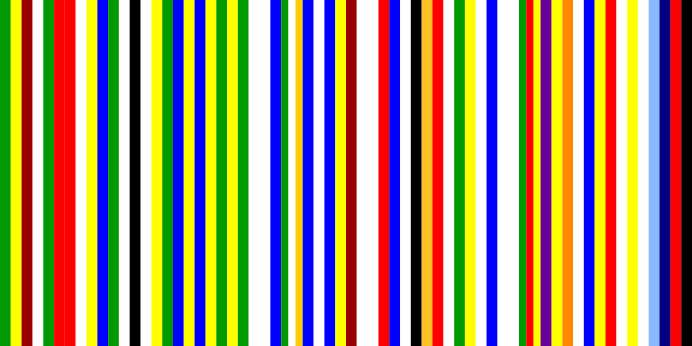

# IE Barcode

This generates an Irish version of OMA/AMO's iconic EU Barcode flag concept, based on a geojson file of the county borders.
Can also be used to generate flag for anywhere else just provide the boundaries and colours of the constituent flags.

## Background

In 2001 Rem Koolhaas and his think-tank AMO developed a proposal for a new flag and visual language for the European Union. 
The concept for the [EU Barcode](http://www.oma.eu/projects/2001/eu-barcode/) was to merge the flags of current EU member states into a new representative flag.

Here is what EU Barcode flag looks like:    


When I saw the flag I thought that it would be interesting to create a Irish version flag following the same concept made up of the country flags. 
At the time I think I got out my colouring pencils and started colouring...

_...a decade passed..._ recently I decided to have another go this time with code !

This node script takes the borders for the 32 counties along with their flag colours, it sorts the counties west to east and and then with the help of d3 generates a flag made up of the constituent flag colours.

It can be used to generate a similar flag for other countries/continents/planets as well.

## Usage

1. Download this repo:

    ``$ git clone git@github.com:vool/ie_barcode.git``

2. Get the borders for the constituent areas in geojson format place this in the `data` directory as `<name>.geojson`, update the config within `app.js` and set `name` to whatever you called this file.

    ```javascript
    var config = {
        "anme": "<name>",
        "flag": {
            "size": [1000, 500] // "size": [3200, 1600]
        }
    };
    ```
    
 The county borders for Ireland are included:

	``data/ireland.geojson``

3.  Add the colour info for the flags of the constituent areas, this should be a json file with elements matching the names in the geojson feature set. A file of this format can be generated from the geojson structure:

    ``node app.js -colours``
    
    this should create:
    
    ``data/<name>.colours.json``
    
    Add the flag colours to the colours arrays.
    
    The county flag colours for Ireland are included:

	``data/ireland.colours.json``

3. Run 

    ``node app.js``
    
    This should create:
    
    ``output/<name>.svg``

     This is what the flag for Ireland looks like:


## Just Say'in

I was a bit disapointed with the outcome, there were a counple of reasons for this:

####Colours
Irish counties do not have any offical flags so I used the [GAA county flags](http://en.wikipedia.org/wiki/Gaelic_games_county_colours) of which the colours are pretty garish.


####Propotrions

Despite being made up from 32 flags the bars are much wider that the EU original, this is largely due to the fact that I keep with the 2:1 proportion of the Irish tricolour and that the GAA county flags are mainly bicolours.
